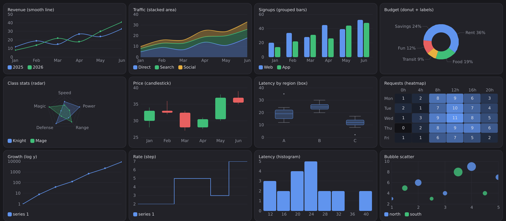
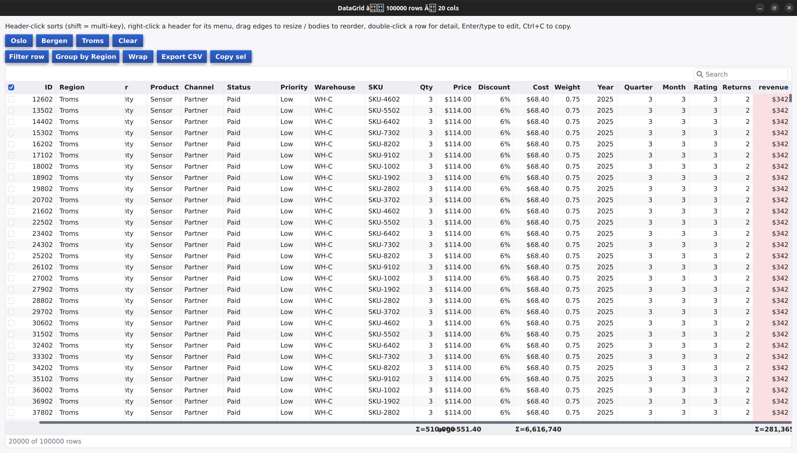

# Vyto [Experimental]

A small, statically typed language with JavaScript-like syntax and Turbo
Pascal's soul: units with separate compilation, records and classes with
virtual dispatch, deterministic reference-counted memory, first-class C FFI,
and near-instant compiles via C transpilation. Designed as a foundation for
building cross-platform UI toolkits.

```js
class Button extends Widget {
    onClick: fn(Button);
    override fn draw(indent: string) { print(indent + "[ " + this.label + " ]"); }
}

fn main() {
    let ok = new Button("btn-ok", "OK");
    ok.onClick = (b) => print("clicked: " + b.label);
    ok.click();
}   // deterministic teardown: deinit runs here
```

## A real app: VytoTodo

[apps/todo](apps/todo/) is a working X11 GUI todo manager written entirely
in Vyto — a mini widget toolkit (virtual dispatch, closure event handlers,
weak parent refs), vytobind-generated Xlib bindings, two native packages,
file persistence, and deterministic display teardown via `deinit`.
AddressSanitizer-clean across full interactive sessions.

```sh
cd apps/todo && ../../vytoc run todo.vt
```

## Quick start

```sh
make                              # builds ./vytoc (plain C99, zero deps)
./vytoc run examples/05_widgets.vt
make test                         # runs all examples against golden output
```

`vytoc build file.vt` compiles to `.vyto-cache/<name>` next to the source.
Generated C is human-readable — look inside `.vyto-cache/`.

## Build a standalone executable

`vytoc run` builds and runs in one step. To produce a distributable binary,
use `vytoc build` — optionally with `-o` to choose the output path and
`--release` for the optimized (`cc -O2`) build:

```sh
./vytoc build apps/snake/snake.vt --release -o snake   # → ./snake
./snake                                                 # run it directly
```

The result is a **self-contained native executable**: the Vyto runtime (ref
counting, strings, arrays, the surface shim) is statically compiled in — there
is no `libvyto.so` to ship. It depends only on the platform's own libraries
(libc, plus e.g. libX11 for a GUI app), so you can copy it anywhere and run it
without `vytoc` installed. A GUI app like snake lands around 48 KB; `strip` (or
`--cc 'cc -s'`) trims it further.

**Dead-code stripping is automatic.** Vyto compiles each `.vt` file as one
translation unit with no symbol-level tree-shaking, so importing a single symbol
from a module pulls that whole module's code into the object. To recover the
difference, every build compiles with `-ffunction-sections -fdata-sections` and
links with `-Wl,--gc-sections`, so any function or datum left unreferenced in the
final program is dropped at link time — vtable data sections keep every
dynamically-dispatched method reachable, so overrides are never wrongly removed.
The effect is large: a program that imports only `lineChart` from the ~2000-line
charting library links at **64 KB** instead of 325 KB, and an app that uses all
15 chart kinds at 317 KB instead of 715 KB. An unused import therefore costs
essentially nothing in the shipped binary. (The `tcc` fast-debug compiler
supports neither flag, so they are skipped there; release builds use `cc`/`gcc`
and get them.)

Cross-compile the same way with `--target` (see below):

```sh
./vytoc build app.vt --release --target linux-arm64 -o app-arm64
```

Apps that use a **prebuilt native library** (e.g. `vyto/gfx`, which links
blend2d) ship the executable plus that library's `.so` next to it by default —
the shared lib is then amortized across apps on the device. For single-file
distribution, `--bundle` statically links every prebuilt native lib (and the
C++/GCC runtimes) into one executable, so there is no `.so` to ship alongside;
it then depends only on base system libraries (libc, libX11):

```sh
./vytoc build apps/uigfx/uigfx.vt --release --bundle -o app   # one file, no .so
```

## Why it's fast

- One pass per module: lex → parse → check → emit C. No IR.
- One `.c`/`.h` per module, content-hash cached — unchanged units are not
  re-emitted or recompiled (the Turbo Pascal unit model).
- Dev builds use `tcc` when installed, `cc -O0` otherwise; `--release` uses
  `cc -O2`. Typical rebuild on this repo's examples: ~50 ms with gcc.

## Highlights

- **Memory**: automatic ref counting, `weak` for back-references, `deinit`
  destructors that fire deterministically — widget trees tear down top-down.
- **Classes**: single inheritance, `virtual`/`override`, `new`, `super.init`.
- **Closures**: `(x) => expr`, typed `fn(T): U`, captures by value.
- **FFI**: `extern "C"` blocks, exact-layout structs, `#link "lib"`.
- **Native packages**: a module directory with `native/src/*.c` (compiled
  and linked automatically) or prebuilt `native/<platform>/*.so` (linked
  with an `$ORIGIN` rpath and shipped next to the executable).
- **vytobind**: generates the `extern` binding from a C header —
  `vytobind zlib.h --lib z --filter 'compress*' > zlib.vt`.
- **C callbacks**: `cthunk(closure)` turns a Vyto closure into a C function
  pointer (userdata-first or `cthunk_last` for userdata-last APIs).
- **Cross-compilation**: `vytoc build app.vt --target linux-arm64`
  (`--cc`/`VYTO_CC` for custom toolchains, e.g. `zig cc`).
- **Safety**: bounds-checked arrays, checked downcasts, `panic` with
  file:line.

See `examples/` (`01_hello` … `50_worker_pool`) for a tour of the language
and stdlib.

## In four snippets

### Canvas drawing — `vyto/gfx`

A 2D canvas over blend2d: gradients, shapes, vector paths, text. From
[apps/gfxdemo](apps/gfxdemo/gfxdemo.vt) (trimmed).

```js
import { Surface, Rect } from "vyto/surface";
import { Canvas } from "vyto/gfx";
import { Path } from "vyto/geom/path";

fn main() {
    let w = 480;
    let h = 320;
    let s = new Surface("canvas demo", w, h);
    let cv = new Canvas(w, h);
    cv.loadFont("/usr/share/fonts/truetype/dejavu/DejaVuSans.ttf", 15.0);

    // background gradient
    cv.linearGradientRect(0.0, 0.0, w as float, h as float,
                          0.0, 0.0, 0.0, h as float, 0x141821, 0x20242E);

    // filled + stroked shapes
    cv.fillRoundRect(24.0, 24.0, 140.0, 90.0, 12.0, 0x3C5AC8);
    cv.strokeCircle(280.0, 70.0, 40.0, 3.0, 0xE0605C);

    // a radial-gradient orb
    let cols: i32[] = [0xFFDD66, 0x20242E];
    let pos: float[] = [0.0, 1.0];
    cv.radialGradientRectN(360.0, 24.0, 90.0, 90.0, 405.0, 69.0, 45.0, cols, pos);

    // a filled vector path (heart)
    let p = new Path();
    p.moveTo(120.0, 200.0);
    p.cubicTo(120.0, 175.0, 60.0, 168.0, 60.0, 200.0);
    p.cubicTo(60.0, 230.0, 100.0, 245.0, 120.0, 265.0);
    p.cubicTo(140.0, 245.0, 180.0, 230.0, 180.0, 200.0);
    p.cubicTo(180.0, 168.0, 120.0, 175.0, 120.0, 200.0);
    p.close();
    cv.fillPath(p, 0x3CA0E0);
    cv.strokePath(p, 3.0, 0xFFFFFF);

    cv.text(24.0, 150.0, "vyto/gfx canvas", 0xECECEC);
    cv.flush();

    s.blitPtr(cv.pixels(), w, h, Rect(0, 0, w, h));
    s.present();
    print("painted " + w + "x" + h + " canvas, stride=" + cv.stride());
}
```

### Widgets — `vyto/ui`

The whole widget set in one screen: layout containers, a text field, a
checkbox, a live-updating list. From [apps/uidemo](apps/uidemo/uidemo.vt).

```js
import { Window, Column, Row, Label, Button, TextField, Checkbox, ListBox } from "vyto/ui";

class Demo {
    list: ListBox;
    status: Label;
    items: string[];
    checked: bool[];

    fn init() {
        this.list = new ListBox();
        this.status = new Label("0 items");
        this.items = [];
        this.checked = [];
    }

    fn add(text: string) {
        this.items.push(text);
        this.checked.push(false);
        this.refresh();
    }

    fn toggle(i: int) {
        this.checked[i] = !this.checked[i];
        this.refresh();
    }

    fn refresh() {
        this.list.set_items(this.items, this.checked);
        this.status.text = this.items.len + " items";
    }
}

fn main() {
    let win = new Window("UIDemo", 420, 480);
    let demo = new Demo();
    let input = new TextField("type and press Enter");
    let add = new Button("Add");
    let dark = new Checkbox("extra padding");
    input.grow = 1;
    demo.list.grow = 1;

    input.onSubmit = (t) => demo.add(t);
    add.onClick = (b) => demo.add("clicked!");
    dark.onToggle = (v) => demo.status.text = "padding=" + v;
    demo.list.onToggle = (i) => demo.toggle(i);

    win.root = new Column([
        new Label("vyto/ui demo"),
        new Row([input, add]),
        dark,
        demo.list,
        demo.status,
    ]);
    win.run();
    print("demo closed cleanly");
}
```

### Charts — `vyto/ui/chart`

A charting library built purely on the `vyto/ui` Painter vocabulary — no new
drawing primitives. One-liner factories mirror the widget ergonomics; fluent
setters tune the rest. A shared `ChartBase` gives every chart nice-number axes,
grid, legend, hover tooltips, and a draw-in animation, so each kind is only its
own geometry. Fifteen kinds ship — line/area/bar/pie, plus radar, candlestick,
box plot, heatmap, a log-scale axis, and more — each rich-first (blend2d AA) and
auto-degrading on the lean X11 tier.

```js
import { Window, Grid, series, ohlc,
         lineChart, barChart, pieChart, radarChartN, candlestick } from "vyto/ui";

// A smooth line, from bare y-values.
let line = lineChart([1.0, 4.0, 2.0, 8.0, 5.0])
    .title("Sales")
    .smooth(true);

// Grouped bars over labelled categories.
let bars = barChart(["Q1", "Q2", "Q3"], [
    series("Web", [20.0, 34.0, 28.0]),
]).title("Signups");

// A donut with outside slice labels + leader lines.
let pie = pieChart(["Rent", "Food", "Fun"], [1200.0, 650.0, 420.0])
    .title("Budget")
    .donut(0.55)
    .sliceLabels(true);

// A multi-axis radar (spider) chart.
let radar = radarChartN(["Spd", "Pow", "Def", "HP", "Mag"], [
    series("Knight", [6.0, 9.0, 4.0, 8.0, 2.0]),
]).title("Stats");

// Financial candlesticks: open / high / low / close per bar.
let candle = candlestick(["Mon", "Tue", "Wed"], [
    ohlc(30.0, 34.0, 28.0, 33.0),
    ohlc(33.0, 36.0, 32.0, 32.5),
    ohlc(32.5, 33.0, 27.0, 28.0),
]).title("Price");

let win = new Window("Charts", 1200, 520);
win.root = new Grid(3, 12, [line, bars, pie, radar, candle]);
win.run();
```



The full 15-chart showcase is [apps/charts](apps/charts/charts.vt) — run it rich
(`./vytoc run apps/charts/charts.vt`) or lean (`… -- --surface`).

### Data grid — `vyto/ui/datatable`

A spreadsheet-grade table over a columnar `DataFrame` — one widget, built on the
same Painter vocabulary. Its powers: native multi-key **sort**, per-column
**filters** + global/scoped **search**, **group-by** with sticky footer
**aggregates**, **multi-select** with a checkbox gutter, inline **cell editing**,
drag-to-**resize**/**reorder** and **frozen** columns, zebra striping, per-column
formatters + heat-maps, row-detail panels, and **CSV/TSV export** — all
engine-side, so it stays snappy on frames with tens of thousands of rows.

```js
import { Window } from "vyto/ui";
import { DataTable } from "vyto/ui/datatable";
import { DataFrame, CK_AUTO, AGG_SUM } from "vyto/data/frame";

let df = new DataFrame(0);
let region  = df.addColumn("Region",  CK_AUTO);
let revenue = df.addColumn("Revenue", CK_AUTO);
// ... append rows ...

let dt = new DataTable(df);
dt.zebra = true;
dt.setFrozen(1);              // pin the first column while the rest scroll
dt.addAgg(revenue, AGG_SUM);  // sticky totals row
dt.showTotals(true);
dt.sortColumn(revenue, false); // sort by revenue, descending

let win = new Window("Sales", 1000, 560);
win.root = dt;
win.run();
```



The full showcase — sort/filter/search, group-by, a frozen ID column, currency
formatters + revenue heat-map, inline filter row, totals, cell editing, and CSV
export — is [apps/datagrid](apps/datagrid/datagrid.vt): run it rich
(`./vytoc run apps/datagrid/datagrid.vt`) or lean (`… -- --surface`).

### CLI + JSON — `vyto/net/http`, `vyto/util/json`

Fetch a JSON array from a REST endpoint and print it. From
[apps/posts](apps/posts/posts.vt).

```js
import { http_get } from "vyto/net/http";
import { json_parse } from "vyto/util/json";

fn main() {
    let url = "https://jsonplaceholder.typicode.com/posts";

    let limit = 10;
    let av = args();
    if (av.len > 0) {
        if (av[0] == "all") { limit = -1; } else { limit = av[0].to_int(); }
    }

    print("GET " + url);
    let resp = http_get(url).timeoutMs(10000).send();
    if (!resp.ok()) {
        print("request failed (status " + resp.status() + ")");
        return;
    }

    let posts = json_parse(resp.text());
    let total = posts.len();
    let show = total;
    if (limit >= 0 && limit < total) { show = limit; }
    print("fetched " + total + " posts, showing " + show);

    let i = 0;
    while (i < show) {
        let p = posts.at(i);
        let title = p.get("title").asString();
        print("#" + p.get("id").asInt() + " (user " + p.get("userId").asInt() + ")  " + title);
        i += 1;
    }
}
```

### Networking — `vyto/net/socket`

Vyto has no threads (§13) — but that doesn't mean one connection at a time.
Non-blocking sockets plus a `PollSet` event loop give real single-thread
concurrency, nginx-style: a slow client dribbling its request never blocks
anyone behind it. From [apps/httpd2](apps/httpd2.vt) (trimmed).

```js
import { socket_listen, Socket, PollSet,
         POLL_READ, POLL_WRITE, POLL_ERR } from "vyto/net/socket";
import { unixSec } from "vyto/util/time";
import { jobj, jint, jstr, json_encode } from "vyto/util/json";

class Conn { // READING until "\r\n\r\n" arrives, then WRITING until drained
    sock: Socket;
    inbuf: string;   // request bytes buffered so far
    out: byte[];     // full response, built once the request is complete
    off: int;        // how much of `out` has been sent already
    writing: bool;    // false = reading the request, true = sending the response
    fn init(sock: Socket) { 
      this.sock = sock; 
      this.inbuf = ""; 
      this.out = bytes(0); 
      this.off = 0; 
      this.writing = false; 
    }
    fn fd(): int {  // used as the connection's key in the `conns` map
      return this.sock.fd as int; 
    }
}

fn main() {
    let srv = socket_listen(8080);
    if (srv == null) { 
      print("cannot bind :8080"); 
      return; 
    }
    // non-blocking: accept()/recv()/send() return immediately instead of
    // blocking, so one thread can juggle many connections at once
    srv.setNonBlocking(true); 
    let srvFd = srv.fd as int;
    print("listening on http://127.0.0.1:8080");
    let ps = new PollSet();      // the poll set: one wait() covers every fd below
    ps.add(srv, POLL_READ);      // watch the listener for incoming connections
    let conns = new Map<string, Conn>(); // fd (as string) -> Conn
    while (true) {
        let n = ps.wait(-1);     // block until >=1 fd is ready; n = how many
        let i = 0;
        while (i < n) {
            let fd = ps.readyFd(i);
            if (fd == srvFd) { 
              acceptAll(srv, ps, conns); // listener ready: accept new connections
            }
            else if (conns.has(str(fd))) {
                let c = conns.get(str(fd));
                if ((ps.readyEvents(i) & POLL_ERR) != 0) { 
                  drop(ps, conns, c);       // connection errored or hung up
                }
                else if (c.writing) { 
                  onWritable(ps, conns, c); // mid-response: keep sending
                }
                else { 
                  onReadable(ps, conns, c); // still reading the request
                }
            }
            i += 1;
        }
    }
}

// Keep accepting until the backlog is drained — one POLL_READ event on the
// listener can mean several pending connections.
fn acceptAll(srv: Socket, ps: PollSet, conns: Map<string, Conn>) {
    while (true) {
        let s = srv.tryAccept();
        if (s == null) { break; } // would-block — accept backlog drained
        conns.set(str(s.fd as int), new Conn(s));
        ps.add(s, POLL_READ);     // new connection starts in READ mode
    }
}

// Fires when a connection has bytes to read. Accumulates into `inbuf` until
// the header block is complete, then hands off to route() and flips to WRITE.
fn onReadable(ps: PollSet, conns: Map<string, Conn>, c: Conn) {
    let rr = c.sock.tryRecv(4096);
    if (rr.wouldBlock()) { 
      return; // nothing to read yet — try again on the next event
    }
    if (rr.status <= 0) { 
      drop(ps, conns, c); 
      return; 
    } // EOF or error
    c.inbuf = c.inbuf + str(rr.data as cstring);
    if (c.inbuf.index_of("\r\n\r\n") < 0) { 
      return; 
    } // header incomplete
    c.out = route(c.inbuf); c.writing = true; // build the response, switch to WRITE
    ps.modify(c.sock, POLL_WRITE);            // wait for this socket to be writable
    onWritable(ps, conns, c); // try to send immediately
}

// Fires when a connection can accept more bytes. Resumes from `c.off`, so a
// response that doesn't fit the socket buffer in one write just continues
// here on the next POLL_WRITE event.
fn onWritable(ps: PollSet, conns: Map<string, Conn>, c: Conn) {
    while (c.off < c.out.len) {
        let sent = c.sock.trySend(c.out.slice(c.off, c.out.len));
        if (sent == -1) { 
          return; 
        } // would-block — resume on the next event
        if (sent < 0) { 
          drop(ps, conns, c); 
          return; 
        } // error
        c.off += sent;
    }
    drop(ps, conns, c); // fully sent — Connection: close
}

// Parse "METHOD /path HTTP/1.1" and dispatch — the only two routes are
// / (html) and /api/time (json); everything else is a 404.
fn route(req: string): byte[] {
    let path = req.slice(0, req.index_of("\r\n")).split(" ")[1];
    print(path);
    if (path == "/") {
        return resp(200, "text/html", "<h1>vyto httpd2</h1><a href=/api/time>/api/time</a>");
    } else if (path == "/api/time") {
        let o = jobj();
        o.set("service", jstr("vyto-httpd2"));
        o.set("unix", jint(unixSec() as int));
        return resp(200, "application/json", json_encode(o));
    }
    return resp(404, "text/plain", "404 not found: " + path + "\n");
}

// Assemble a complete HTTP/1.1 response (headers + body) as bytes.
fn resp(code: int, ctype: string, body: string): byte[] {
    let head = "HTTP/1.1 " + code + " OK\r\nContent-Type: " + ctype
             + "\r\nContent-Length: " + body.len + "\r\nConnection: close\r\n\r\n";
    return strBytes(head + body);
}
// Connection finished (fully sent) or failed: unregister and forget it.
fn drop(ps: PollSet, conns: Map<string, Conn>, c: Conn) {
    ps.remove(c.sock); c.sock.close(); conns.remove(str(c.fd()));
}
// string -> byte[] — Socket.trySend only accepts raw bytes.
fn strBytes(s: string): byte[] {
    let b = bytes(s.len);
    let i = 0;
    while (i < s.len) { b[i] = s[i] as byte; i += 1; }
    return b;
}
```

## Standard library

Bundled under `lib/vyto/`, imported as `vyto/<path>`. Modules marked ⚙ are
backed by a native shim (compiled from source or a `#link`ed system library);
everything else is pure Vyto.

**Core & utilities**

| Module | What it gives you |
|--------|-------------------|
| `vyto/util/fmt` ⚙ | printf-style formatting (`fmt`, `fixed`, `hex`, `commas`, …) |
| `vyto/util/json` | JSON parse/encode (`JsonValue`, `json_parse`, `json_encode`) |
| `vyto/util/date` ⚙ · `vyto/util/time` ⚙ | calendar dates (strftime/strptime) · clocks, durations, timers |
| `vyto/math` ⚙ | libm math (`sin`, `sqrt`, `pow`, …) |
| `vyto/io/file` ⚙ | files & paths (`File`, read/write, `file_exists`, `mkdirs`, …) |
| `vyto/os` ⚙ | environment, args, process helpers |
| `vyto/os/worker` ⚙ | `fork()`-based `WorkerPool` — CPU parallelism, no shared state |

**Internationalization** — `vyto/intl` ⚙ (ICU-backed)

| Module | What it gives you |
|--------|-------------------|
| `vyto/intl` | `Locale`, locale detection, shared enums |
| `vyto/intl/unicode` | codepoints, NFC/NFD normalization, locale case, grapheme/word/line segmentation, collation |
| `vyto/intl/number` | locale number / currency / percent formatting |
| `vyto/intl/datefmt` | locale date/time formatting |
| `vyto/intl/message` | ICU-MessageFormat subset + CLDR plurals + JSON catalogs |

**Networking** — `vyto/net` ⚙

| Module | What it gives you |
|--------|-------------------|
| `vyto/net/http` ⚙ | HTTP client, `HttpPool` fan-out (libcurl multi) |
| `vyto/net/socket` ⚙ | TCP/UDP sockets, non-blocking mode, `PollSet` event loop |
| `vyto/net/websocket` ⚙ | WebSocket client |

**Graphics & UI**

| Module | What it gives you |
|--------|-------------------|
| `vyto/surface` ⚙ | windowing + event loop (X11 / Win32 / framebuffer / headless) |
| `vyto/gfx` ⚙ | 2D canvas (blend2d): shapes, gradients, text, images |
| `vyto/ui` | widget toolkit — layout, widgets, dialogs, nav, skins (iOS/macOS/Material) |
| `vyto/anim` · `vyto/geom` | animation/easing · geometry & vector paths |

**Hardware** — `vyto/hw`

| Module | What it gives you |
|--------|-------------------|
| `vyto/hw/serial` ⚙ | serial / TTY ports as poll-able fds |
| `vyto/hw/usb` ⚙ | USB device enumeration |

Some packages need a one-time native setup — see [Native dependencies](#native-dependencies).

## Layout

```
src/       compiler (C99): lexer, recursive-descent parser, checker, C emitter
runtime/   vyto_rt.{c,h}: RC objects, strings, arrays, maps, closures
lib/vyto/  bundled stdlib modules (see "Standard library" above)
examples/  01_hello … 50_worker_pool + golden .expected outputs
```

## Native dependencies

The compiler itself (`make`) needs only a C99 toolchain — zero third-party
deps. Some stdlib packages bind native libraries and need a one-time setup
before use (a bare clone builds `vytoc` and runs the core/stdlib examples
without them):

- **`vyto/gfx`** (blend2d) — run `lib/vyto/gfx/native/build-blend2d.sh`
  (needs cmake + ninja + a C++ compiler). Not vendored in git.
- **`vyto/intl`** (ICU) — links the system ICU by default; install
  `libicu-dev` (Debian/Ubuntu) or `libicu-devel` (Fedora). For `--bundle` or
  targets without a system ICU, run `lib/vyto/intl/native/build-icu.sh`.

## Platform status

Vyto compiles to C99 against an ~1.9K-line runtime with no dependencies
beyond `malloc`/`stdio`/`string.h`, so the language itself is portable
anywhere a C compiler is. Status below is about the *surface* (windowing)
backend and stdlib native shims, which vary per target.

| Platform | Status | Notes |
|----------|--------|-------|
| **Linux** (x86_64, arm64) | ✅ Fully supported | Primary dev + CI platform. X11 GUI backend, full stdlib, `make test` runs here. |
| **Embedded / bare-metal** | ✅ Core supported | `--freestanding` builds the compiler and runtime with zero libc — six `vt_host_*` hooks (alloc/realloc/free/write/write_err/abort) are the entire platform seam, output is a linkable `.a`. Verified in the test suite. No display driver ships in-tree; that's embedder-supplied, as with any bare-metal C project. |
| **Windows** | 🚧 Partial, untested | `--target windows-x64` cross-compile is wired (MinGW), and LLP64 type mapping (`clong`/`culong`) is done. A Win32 GDI surface backend exists in `vsurf.c` (WndProc → event queue) but has never been built or run — no Windows/MinGW toolchain in CI yet. Some stdlib shims (`util/fmt`, `math`) are Windows-clean as-is; others (`net/socket` via Winsock, `os/worker` which needs `fork()`) need adaptation. |
| **macOS** (x86_64, arm64) | 🚧 Partial, untested | Cross-compile triples exist but need your own `--cc` (no bundled cross toolchain from Linux). CLI/stdlib should build as-is (POSIX + C99). GUI currently falls through to the X11 backend (needs XQuartz) — no native Cocoa/Metal surface shim yet. |
| **Android** | 📋 Planned | No NDK integration or surface shim in the tree yet. |
| **iOS** | 📋 Planned | No native surface shim or Xcode project. `apps/iphone` is a themed UI simulator running on the desktop backend, not an actual iOS build. |

Legend: ✅ works today · 🚧 partially wired, unverified · 📋 not started.

## License

MIT — see [LICENSE](LICENSE).
