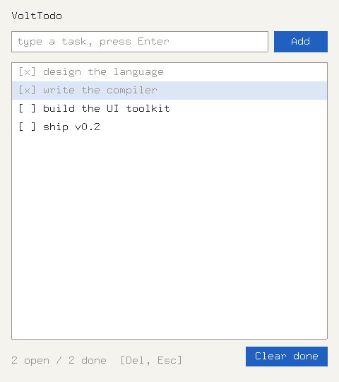

# VoltTodo

A real X11 todo application written entirely in Volt — the proof that the
language can carry a UI toolkit.



```sh
../../voltc run todo.vt                       # from apps/todo/
VOLT_TODO_FILE=~/tasks.txt ../../voltc run todo.vt
```

Controls: type + **Enter** (or the Add button) adds a task · **click** a row
toggles done · **Up/Down** move the selection · **Del** deletes the selected
task · **Clear done** removes finished tasks · **Esc** or the window close
button quits. Tasks persist to `todo.txt` (override with `VOLT_TODO_FILE`),
one `1|title` line per task.

## Architecture — what it showcases

| Piece | Volt features on display |
|-------|--------------------------|
| `x11/x11.vt` | **voltbind-generated** binding of the real system `Xlib.h` |
| `x11/xshim.vt` + `native/src/xshim.c` | native package with bundled C source; shim for what C headers can't express (the `XEvent` union, macros); enum → const generation |
| `fio/` | second native package: line file IO, `getenv`; `str(cstring)`, null-checked C pointers |
| `ui.vt` | the mini toolkit: `Widget` base class, `Label`/`Button`/`TextInput`/`ListView` via **inheritance + virtual/override draw and click**, `weak` parent refs, `Rect` value struct, `Ui.deinit` **deterministically frees the GC and closes the display** |
| `model.vt` | `Task`/`Store` classes, arrays, `Map` counts, `slice`-based save-file parsing |
| `todo.vt` | closures capturing `app` for every event (`onClick`, `onSubmit`, `onToggle`), the poll-based event loop, `as` casts at the FFI boundary |

## The reference-cycle lesson

Event closures capture the `App`; the `App` owns the widgets that hold those
closures. That's a reference cycle, and Volt uses reference counting — so
`App.teardown()` nulls the closure fields and the widget tree before exit.
Watch it work: quitting prints `[ui] display closed` from `Ui.deinit` only
because the cycle was broken. (Weak *closure captures* are future work;
`weak` fields already cover parent pointers.)

Verified leak-free with AddressSanitizer across a full add/toggle/delete
session — zero Volt-runtime leaks, and the one Xlib GC allocation is freed
in `deinit` via `XFreeGC`.

## Rebuilding the bindings

```sh
make test          # regenerates x11.vt + xshim.vt with voltbind and builds the app
```

`tests/xsend.c` is a tiny XSendEvent injector used to drive the app in
automated verification (type/key/click without xdotool).
